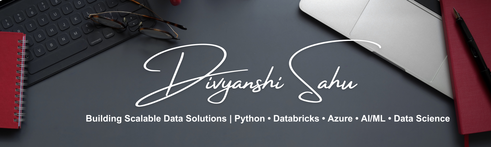

<!--**DivyanshiSahu19/DivyanshiSahu19** is a ✨ _special_ ✨ repository because its `README.md` (this file) appears on your GitHub profile.-->

# Hi there 👋, I'm Divyanshi Sahu

Application Developer @Accenture | Data Engineering | Databricks | Cloud (Azure/AWS) | AI & ML Enthusiast  

## About Me

🎓 I’m a Computer Science and Engineering graduate from DIT University with a specialization in **Data Science & Analytics**.  
💼 Currently working at **Accenture** as an **Application Developer**, where I design and build **scalable data engineering solutions** using **Databricks, Python, SQL, and Azure**.  

🌱 My journey spans **data engineering, AI/ML, and cloud computing**, with hands-on experience in building ETL pipelines, optimizing workflows, and developing data-driven applications.  

💡 I believe in continuous learning, problem-solving, and using technology to create impactful solutions.  

## 🛠 Tech Stack

As a **Data Engineer & AI Enthusiast**, my toolbox includes:

### 📊 Data Engineering & Cloud

### 🧠 AI, ML & Data Science

### 🛠 Software Development

## 💼 Experience

**Application Developer – Accenture** _(May 2025 – Present)_  
- Designed and developed **scalable data solutions** on the **Databricks Unified Data Analytics Platform**.  
- Built and optimized **ETL pipelines** for seamless data integration and transformation.  
- Collaborated with cross-functional teams to integrate applications into existing data workflows.  
- Contributed to **application debugging, optimization, and performance improvements**.  
- Applied **Agile & DevOps principles** throughout the development lifecycle.  
- **Tech Stack:** Databricks, Python, SQL, Azure, AWS, Git, ETL Tools  

**Associate Software Engineer – Accenture** _(Sep 2024 – May 2025)_  
- Worked with **Azure Databricks, PySpark, SQL, and Unix** to deliver enterprise data engineering solutions.  
- Gained hands-on experience with **cloud platforms (Azure, AWS)**.  
- Strengthened problem-solving skills in **data science and scalable application development**.  

**Data Engineer Intern – Arthrex** _(Jun 2024 – Aug 2024)_  
- Supported data engineering workflows and data transformation tasks.  
- Worked on designing **scalable, reliable data pipelines**.  

**Software Development Virtual Experience – Datacom** _(Jun 2023 – Jul 2023)_  
- Reviewed web application code and suggested improvements.  
- Identified and fixed bugs to improve application reliability.  

**Technology Virtual Experience (STEM) – Deloitte** _(May 2023 – Jun 2023)_  
- Unified multiple data models by developing efficient algorithms.  
- Built a **dashboard for telemetry data analysis**.  
- Identified vulnerabilities and assisted in a **cybersecurity investigation**.  

## 📊 GitHub Stats

## 📫 Let's Connect

